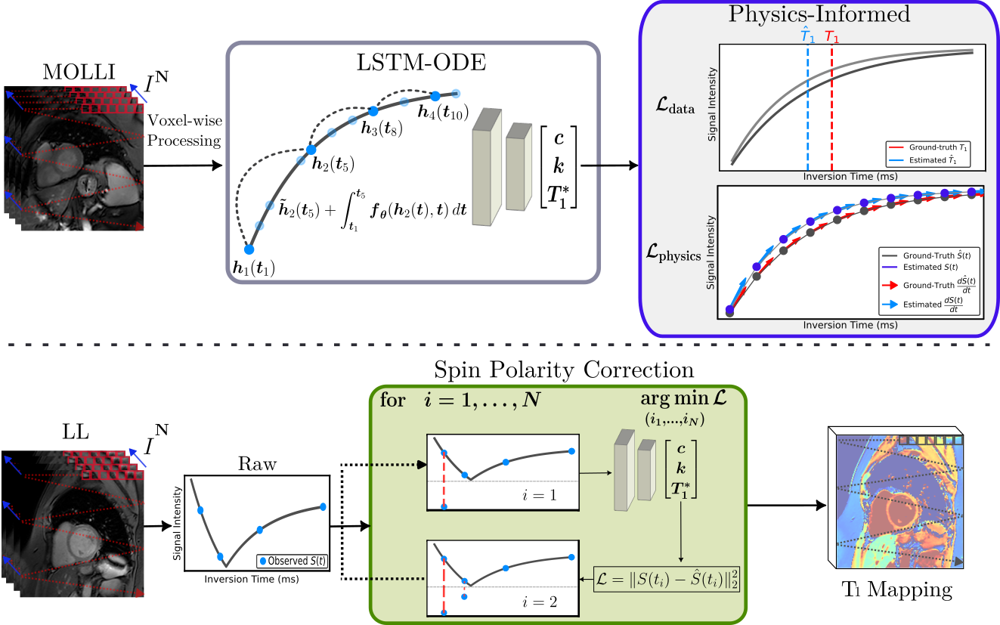

# Physics-Informed Neural ODEs for Temporal Dynamics Modeling in Cardiac $T_1$ Mapping

**MICCAI 2025** · *Early Acceptance (top ~9%)* · **Poster Spotlight**
📄 [Paper](https://papers.miccai.org/miccai-2025/0698-Paper4475.html) · 📚 [arXiv](https://arxiv.org/abs/2507.00613)

## Overview

Spin-lattice relaxation time ($T_1$) is an important biomarker in cardiac parametric mapping for characterizing myocardial tissue and diagnosing cardiomyopathies.

Conventional MOLLI acquires 11 breath-hold baseline images with interleaved rest periods to ensure mapping accuracy. However, prolonged scanning can be challenging for patients with poor breathholds, often leading to motion artifacts that degrade image quality. In addition, mapping requires a voxel-wise nonlinear fitting to a signal recovery model involving an iterative estimation process which scales with $\mathcal{O}(n^4)$ to identify polarity transitions (null points).

We propose an accelerated, end-to-end mapping framework leveraging Physics-Informed Neural Ordinary Differential Equations (ODEs) to model temporal dynamics and address these challenges. Our main contributions are:

- High-accuracy $T_1$ estimation from a sparse subset of baseline images.
- Efficient null index estimation at inference.
- Continuous-time LSTM-ODE model enabling selective LL data acquisition with arbitrary time lags.
- Improved generalization using physics-based formulation over direct data-driven $T_1$ priors.



## Released Models

We release pretrained models under the `runs/` directory for **MOLLI 3(3)5** acquisitions:

| Model | Description |
|------|-------------|
| `molli_3_best_weights.pt` | 3 acquisitions |
| `molli_4_best_weights.pt` | 4 acquisitions |
| `molli_5_best_weights.pt` | 5 acquisitions |
| `molli_baseline_best_weights.pt` | Full 11-acquisition baseline |

All experiments share the same `config.yml`; only the number of acquisitions differs across runs.  
Detailed parameter descriptions are documented in the docstrings of the high-level modules.

## How to use

### Virtual Environment Setup

```bash
git clone <repo-url>
cd <repo-name>
python -m venv .venv
source .venv/bin/activate
pip install -e .
```

**PyTorch + CUDA Notes**:

If you encounter CUDA-related issues when installing PyTorch via dependencies, the recommended workaround is to reinstall PyTorch explicitly. For example:

```bash
pip uninstall torch
pip install torch --index-url https://download.pytorch.org/whl/cu118
```

Adjust the CUDA version (cu118) as needed for your system.

### Data Format Assumptions

Training and inference assume MOLLI data stored in `.mat` files with the following fields:

- `volume` : `(H, W, T)`
MOLLI signal intensities over time.

- `tvec` : `(T,)`
Inversion times / elapsed time after inversion pulse.

- `pmap_mse` : `(H, W, 3)`
Least-squares fitted parameters `(c, k, T1*)` from
$S(t) = c \left(1 - k e^{-t / T_1^*}\right)$.

- `null_index` : `(H, W)`
Polarity transition (null-point) index per voxel.

- `T1` : `(H, W)`
Reference $T_1$ map computed as $T_1 = T_1^*(k - 1)$.

### Training

Training follows a **two-stage strategy**:

1. **Baseline training** using the full MOLLI sequence (`max_acquisitions`, e.g. 11).

2. **Accelerated training** using sparse acquisitions (`num_acquisitions`).

#### Baseline Training

```bash
pinn-molli-train --config-path $CONFIG_PATH --baseline
```

If no baseline checkpoint is found, training will raise a `FileNotFoundError` and prompt baseline training.

#### Accelerated Training

Once a baseline exists, the `--baseline` flag can be omitted. The training script will automatically locate the baseline checkpoint within the experiment directory.

### Inference / Testing

```bash
pinn-molli-test \
  --config-path $CONFIG_PATH \
  --load-state-dict $PATH_TO_WEIGHTS \
  --mc-samples $MC_SAMPLES
```

**Tip:**  
Run `--help` with either command to view all available parameters and recommended defaults.

### Citation

```bibtex
@InProceedings{10.1007/978-3-032-04927-8_47,
author="Capit{\~a}o, Nuno
and Zhang, Yi
and Zhao, Yidong
and Tao, Qian",
title="Physics-Informed Neural ODEs for Temporal Dynamics Modeling in Cardiac {\$}{\$}T{\_}1{\$}{\$}Mapping",
booktitle="Medical Image Computing and Computer Assisted Intervention -- MICCAI 2025",
publisher="Springer Nature Switzerland",
pages="492--501",
year={2025},
organization={Springer}
}
```
